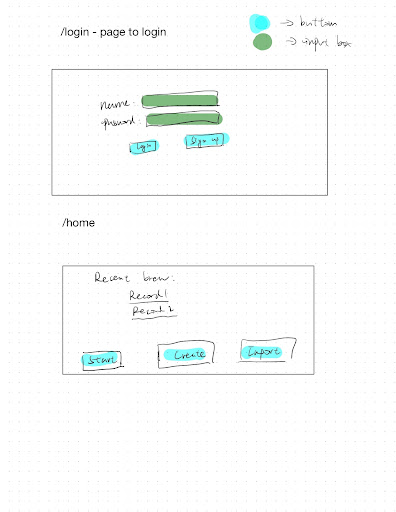
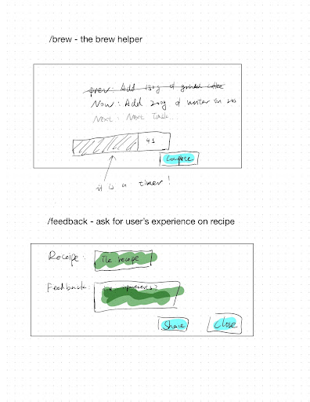
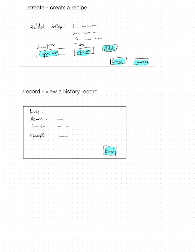
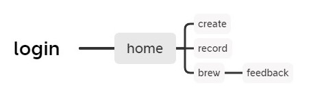

(__TODO__: your project name)

# Coffee Diary

## Overview

Brewing a cup of coffee is all about patience, timing, and creativity. Coffee Diary will help you to brew your coffee with perfect timing, record & share your coffee recipe with the community, and learn from the award wining brew techniques.

Features:

+ Brew helper that helps you brew award winning coffee recipe by yourself
+ Recipe recorder: Record your brewing history, help you record the coffee bean/grinder sitting/brew technique; import other's recipe


## Data Model

(__TODO__: a description of your application's data and their relationships to each other) 

`user`:

+ profile/credential
+ array of history brew records(`record`)
+ stats


`record`

+ The `recipe` used for this brew
+ user's comment/feedback of this brew

`recipe`

+ info
+ array of `task`

`task`

+ time: how much time assigned to this task?
+ discription: what to do for this task?

An Example User:

```javascript
{
  usr_name: "Anthony Douglas"
  credential: //
  records: //array of record
  stats: {numberOfRecord: 1}
}
```

Example record:

```javascript
{
  recipe: //the recipe
  comment: "A little bit overbrewed, try lower water temp next time!"
}

```

Example recipe:
```js
{
  info:{
    water_temp:90,
    grinder: "grinder name",
    bean: "bean name"
  }
  Tasks: //array of action
}
```

example task

```javascript
{
  time: 20
  discription: `add 200ml water in ${this.time} seconds`
}
```


## [Link to Commented First Draft Schema](db.mjs) 

(__TODO__: create a first draft of your Schemas in db.mjs and link to it)

## Wireframes 





## Site map



## User Stories or Use Cases

1. as non-registered user, I can register a new account
2. as a user, I can log in to the site
3. as a user, I can create my own recipe by adding tasks
4. as a user, I can share my recipe by generating a link pointing toward the record page
5. as a user, I can view all my brew history and my feedback and the recipe
6. as a user, I can view a recipe start to play the insturctions
7. as a user, I can write and store my feedback after the instruction.

## Research Topics
* (5 points) Auto test with Selenium
* (2 points) [MUI](https://mui.com/)
    * I will use MUI kit to make my app follow [Material Design](https://m2.material.io/design)
* (6 points) React.js + express
    * Deploy a frontend+backend app

## [Link to Initial Main Project File](app.mjs) 

(__TODO__: create a skeleton Express application with a package.json, app.mjs, views folder, etc. ... and link to your initial app.mjs)

## Annotations / References Used

1. [passport.js](http://passportjs.org/docs)
2. [React.js](https://reactjs.org/)

